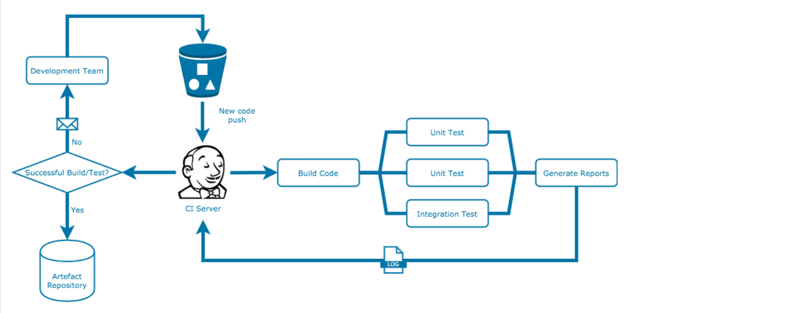

<h1 align="center">Music Playlist Application</h1>
   

<!-- PROJECT LOGO -->
 

    

1. [ Project Brief. ](#brief)
2. [ Planning. ](#planning)
3. [Risk Assessment](#risk)
4. [User Stories](#user)
5. [Creating the Database](#createdb)
6. [Walkthrough](#video)
7. [CRUD](#crud)
8. [Technical Build Requirement](#build)
9. [Testing](#test)
10. [Automation](#automation)
11. [Issues](#issues)
12. [Future Consideration](#future)

(<a href="#top">back to top</a>)
  

<!-- ABOUT THE PROJECT -->
## project brief
<a name="brief"/>
The project is a CRUD application built with the technologies outlined below.  The workspace was created by using tables created in MySQL connected to database server and a Virtual Machine created in Google Cloud.  The specifics of the app are to give users the ability to create a list of their favourite musicians/artists, add tracks to the artists and then generate a list of musicians and their music.  The update and delete functionality allows users to delete tracks from the list and to change the name of the artist.

Essentially the application is designed to demonstrate the implementation of learning gained and meets the following requirements

| Requirement | Detail |
| --- | --- |
| Trello board  | Kanban board with full expansion on user stories, use cases, tasks and issues within the project.|
| Relational Database | persistent storage with at least 2 tables in it |
| Clear Documentation | Design phases, architecture and risk assessment |
| CRUD application | Create an app which Reads, Creates, Updates and Deletes Using Python best practices |
| Fully designed test suites | create and run automated tests to provide a high level of coverage |
| Functioning front-end | Create an integrated API and front end using Flask |

## Planning 

(<a href="#top">back to top</a>)

<a name="planning"/>
The planning stage involved the use of Trello as a project management tool where a workboard was created to hold the User Stories and to record the progress of the various build stages of the application

 

    

## Risk Assessment

(<a href="#top">back to top</a>)

<a name="risk"/>

A risk assessment was generated to ensure the build process went as smoothly as possible and introduced control measures for the potentialy adverse effects of the variables identified.

    

## User Stories 

(<a href="#top">back to top</a>)

<a name="user"/>
Implemented:

* **As a User I want to be able to enter a track name and an artist name, so that I can create a record of my favourite music**

* **As a User I want to be able to retrieve a list of the tracks I have saved in the database, so I can view them**

* **As a User I want to be able to edit the Artist details so I can change the name of the Artist**

* **As a User I want to be able to delete tracks that I have added as my tastes might change**

Not implemented:

* **As a User I want to create records about my favourite artists so I can check their gig schedule and access their musician webpage**

## Creating the Database

(<a href="#top">back to top</a>)

<a name="createdb"/>
The database was created using mySQL and the initial plan was to create three tables.  One to hold data for Artists, one to hold data for Tracks (one artist to many tracks) and one table to hold data for Albums (many tracks to many artists).  However as the MVP involved creating two tables the tables Artist and Music were implemented first as these would form the core functionality of the application.  The EDR diagram shows the relationships for these tables.

 

    

The relationship between the tables is defined by the Artist ID which is then used as a foreign key within the Music table.

The app would work by a user entering the details of one of their favourite artists.  The add music would allow users to enter the favourite tracks and to then select the artist (artist choices being populated into a dropdown box) to add the track to the artist selected from the dropdown.  The app would then allow users to select the option to view a list of their music, to delete tracks and then to edit the artist name.   

<a name="video"/>

## Video walkthrough of the fuctioning app

     

## CRUD

(<a href="#top">back to top</a>)

<a name="crud"/>
This functionality represents the CREATE, READ, UPDATE and DELETE aspects of data retrieval and manipulation.  For the project CRUD is implemented as follows:

* CREATE - Create Artists and Tracks
* READ   - View a list of the artists and tracks on one page
* UPDATE - To update the Artist name
* DELETE - To delete a track from the database

<a name="build"/>

## Technical Build Requirements

(<a href="#top">back to top</a>)

* [python 3 ](https://www.python.org/about/) 
* [Flask](https://flask.palletsprojects.com/en/2.1.x/?msclkid=9eb344a1b67511ec879f0992ab58cf87#user-s-guide)
* [Jinga](https://palletsprojects.com/p/jinja/)
* [mySQL](https://dev.mysql.com/doc/)
* [Google Cloud Platform](https://cloud.google.com/docs)

The app uses python3 which is a high level scripting programming language which integrates Flask as a lightweight micro-framework for developing web applications.  The HTML pages were created using Jinga which is a fast extensible templating engine.

In terms of infrastructure the database server was hosted by Google Cloud platform and used a Virtual Machine to connect mySQL to VScode where a cloned down Github hosted repository holds the source code.

    

## Testing

(<a href="#top">back to top</a>)

<a name="test"/>
Once the application code was in place and the app was functioning correctly testing was implemented.  Usually the Test Driven Development would be the process to follow (i.e. writing tests before the code and writing the code so the tests pass), however as the project forms part of a wider learning and training exercise this was not an expectation.

What is a test - "In the simplest terms, a test is meant to look at the result of a particular behavior, and make sure that result aligns with what you would expect."
https://docs.pytest.org/en/7.1.x/explanation/anatomy.html

Two types of tests were implement 
* [pytest ](https://docs.pytest.org/en/7.1.x/index.html) - tests which passed if the running code gave expected results
* [Pytest Coverage](https://pypi.org/project/pytest-cov/) - a report which indicated the percentage of which the tests covered the entirety of the code base.

## Pytest

## Test Base
Pytest essentially allowed a test application to be created which ran through all of the build steps including creating the database, tables and then adding in test data.  In this case a "test artist" and "test track" were added into the created database tables and the test ensured that the data had been successfully added into the tables.

## Test Views

These tests passed if executing the route functions resulted in success response codes and the asserted data from the rendered html template ( i.e. the home route had a 200 response code and the word "Music" was rendered in the home template.

## Test Data

These tests passed if executing adding data from the form to the route resulted in success response codes and the asserted data from the rendered html template ( i.e. adding "Test Artist" to the add_artist URL resulted in a 200 response code and the word "Artist Added!" was rendered in the home template.

The tests, when run would result in output to the terminal as below

    

## Pytest Cov

When considering the combined scope of all of the individual tests the coverage report would provide a percentage.  The percentage effectively showed the extent to which the individual tests covered entired the code base.
When run the following output would be displayed in the terminal.

    

The full tests can be found by clicking <a href ="https://github.com/simharuk2021/musicapplication/blob/testing/tests/test_app.py" target="blank">here </a>

## Build Automation

(<a href="#top">back to top</a>)

<a name="automation"/>
In building this project a list of commands had to be executed in order to install the various modules and dependencies of the project.  A virtual environment had to be created and then the database connection string had to be exported before the app could be run.  Further commands were required to run the tests and also to generate the reports.  In terms of automation all of these commands could be run using <a href = "https://www.jenkins.io/">Jenkins</a>.

    

Within Jenkins a link to the github repository (hosting the source code) was made and a script with build and test stages was run.  The successfull build resulted in an hosted application which produced the following console output within Jenkins.

    

<a name="issues"/>

## Issues

During the design stage the initial application had three tables.  The first two were Artists and Music and the third was going to be album.  This would have allowed created an additional relationship of many Artists to one Album.  Whilst at the beginning stage I did not feel this to be too ambitious, however due to tutor absence resuting in scaled back support, the more realistic decision was to create a more basic app which functioned well and met the MVP requirements.    

There were also some issues whilst developing the app with the connection string and the repitition of running the same commands.  These issues were averted by the use of a text file containing an ordered list of commands alongside the connection string which could be copied into the terminal.  For the purposes of security this file was included in the .gitignore file and was prevened from being made visible in the public repository. 

In terms of the infrastructure issues also arose due to my VM having 1GB of RAM.  As the application became more complex the operations took longer and eventually began to seize.  With tutor support I was able to upgrade the VM whilst maintaining persistent data storage.

<a name="future"/>

## Future Considerations

(<a href="#top">back to top</a>)

Given more time I would consider adding more functionality to the app by adding the Album table and also adding a further column to the Artist and Music tables where Users could access the URL of the Artist and potentially listen to the track.

Choosing the correct VM performance level could also result in better run speeds and make the process of developing applications less error prone and time consuming.
         
Due to the unforseen nature of staff absences this is a considerable area which needs to be included in future risk assessments.

Whilst the use of Github Copilot was not particularly useful in the development stage the extension had a massive benefit to the automatic creation of tests, which considerably simplified the testing stage. 
         
## Acknowledgements
* Earl Gray (QA Tutor)
* Leon Robinson (QA Tutor)
* Harry Volter (QA Tutor)

## Project by

**Simon Hart**

